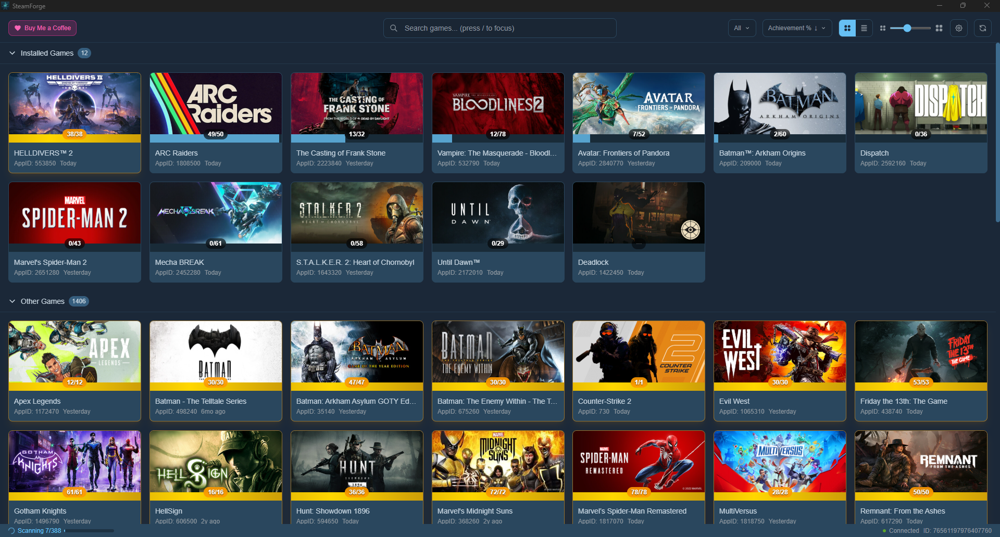
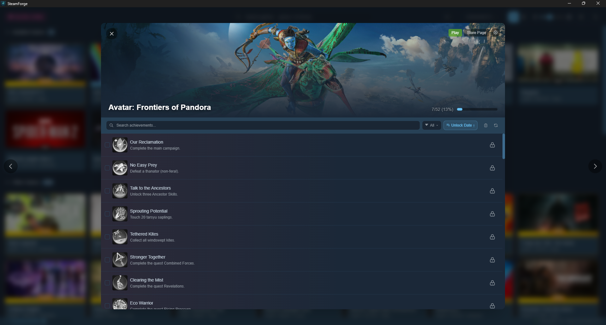

# SteamForge

[](LICENSE)

A desktop Steam achievement manager built with Go, Svelte 5, and Wails. Browse your game library, view achievement rarity, and unlock or lock achievements with a clean Steam-themed UI.

> **Disclaimer:** SteamForge modifies achievement data through the Steamworks SDK. Use at your own risk — modifying achievements may violate Steam's terms of service. This project is provided for educational and personal use.

## Download


| Platform | Link |
| -------- | ---- |
| Windows  | [steamforge.exe](https://github.com/steamforge-app/steamforge/releases/latest/download/steamforge.exe) |
| Linux    | [steamforge](https://github.com/steamforge-app/steamforge/releases/latest/download/steamforge) |

## Screenshots

<p align="center">
  
  <br><em>Browse your Steam library in grid view with achievement progress</em>
</p>

<p align="center">
  
  <br><em>Fullscreen achievement view with global rarity percentages</em>
</p>

## Features

- **Game Library** - Browse your Steam games in grid or list view with search, filtering (all, incomplete, perfected, no achievements), and sorting (name, last played, achievement %)
- **Achievement Management** - View, unlock, and lock individual achievements or bulk modify selections. Supports auto-save or manual save workflows
- **Global Rarity** - Displays global unlock percentages from the Steam Web API with color-coded rarity tiers
- **Achievement Scanning** - Scan your entire library to fetch achievement counts and track overall completion
- **Carousel Navigation** - Switch between games with carousel-style card transitions (modal view) or arrow navigation (fullscreen view)
- **Profile Detection** - Automatically detects whether your Steam profile is public or private and adapts data sources accordingly
- **Local Caching** - Caches achievement counts and rarity percentages to minimize API calls
- **Keyboard Navigation** - Arrow keys to switch games, `/` to focus search, `Escape` to close

## Tech Stack

| Layer    | Technology                  |
| -------- | --------------------------- |
| Backend  | Go 1.23                     |
| Frontend | Svelte 5, TypeScript 5.7    |
| Desktop  | Wails v2                    |
| Styling  | Tailwind CSS 4              |
| Build    | Vite 6                      |

## Prerequisites

- [Go 1.23+](https://golang.org/dl/)
- [Node.js 18+](https://nodejs.org/)
- [Wails v2 CLI](https://wails.io/docs/gettingstarted/installation)
- Steam must be running on the same machine

### Linux

WebKit2GTK is required:

```bash
# Ubuntu/Debian
sudo apt install libwebkit2gtk-4.1-dev
```

## Development

```bash
wails dev -tags webkit2_41
```

This starts a Vite dev server with hot reload for the frontend and live reloads the Go backend.

## Building

```bash
# Linux
wails build -tags webkit2_41 -ldflags="-s -w"

# Windows
GOOS=windows wails build -ldflags="-s -w"
```

The compiled binary is output to `build/bin/`.

## Project Structure

```
steamforge/
├── app.go                    # Main Go API surface
├── main.go                   # Wails entry point
├── internal/
│   ├── models/               # Achievement & Game data models
│   ├── services/             # GameService, AchievementService, WebAPI
│   ├── steam/                # Steamworks SDK wrapper, local stats parsing
│   ├── settings/             # Persistent settings & achievement cache
│   └── cache/                # Image caching
├── frontend/
│   ├── src/lib/
│   │   ├── pages/            # GamePicker, GameManager
│   │   ├── components/       # GameCard, AchievementRow, AchievementToolbar, etc.
│   │   ├── stores/           # Svelte stores (games, achievements, settings, app)
│   │   └── utils/            # Steam image URLs, rarity tiers, date formatting
│   └── wailsjs/              # Auto-generated Go bindings
├── wails.json                # Wails configuration
└── Makefile                  # Build scripts
```

## How It Works

SteamForge connects to Steam through the Steamworks SDK to read and modify achievement state. When your Steam profile is public, it can also fetch achievement data from the Steam Community without requiring a game connection. Global unlock percentages are fetched from the Steam Web API with rate limiting and retry logic.

Achievement changes are written back through the Steamworks SDK, which requires the target game to be connected via Steam. The app handles connection management automatically when needed.

## Support

If you find SteamForge useful, consider [buying me a coffee](https://ko-fi.com/ratkill).

## License

This project is licensed under the [MIT License](LICENSE).
